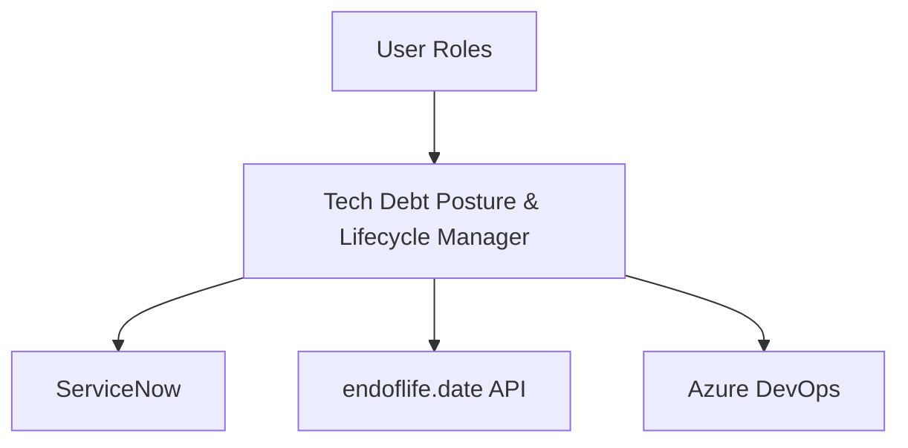
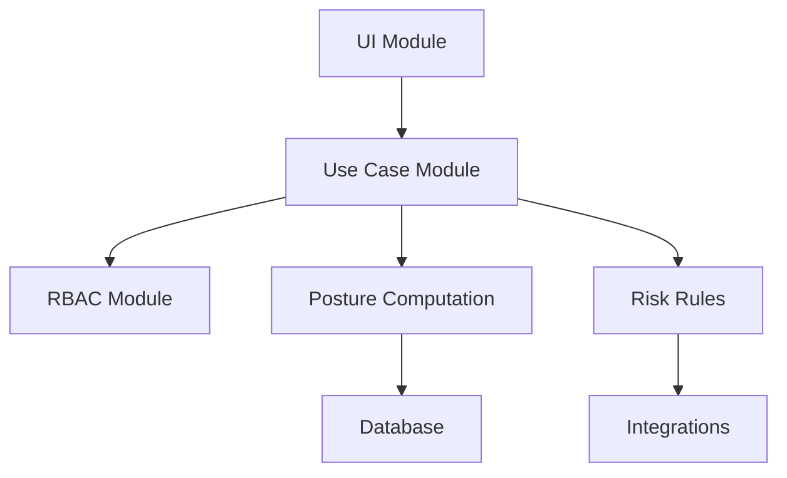

# C4 Model Diagram

## C4 Context Diagram (Mermaid)


## C4 Container Diagram (Mermaid)
```mermaid
graph TD
	WebUI[Web UI (AdminLTE, jQuery)]
	AppLayer[Application Layer (Node.js/Express.js)]
	Domain[Domain Layer]
	Infra[Infrastructure Layer (PostgreSQL, Integrations)]
	WebUI --> AppLayer
	AppLayer --> Domain
	Infra --> Domain
```

## C4 Component Diagram (Mermaid)

