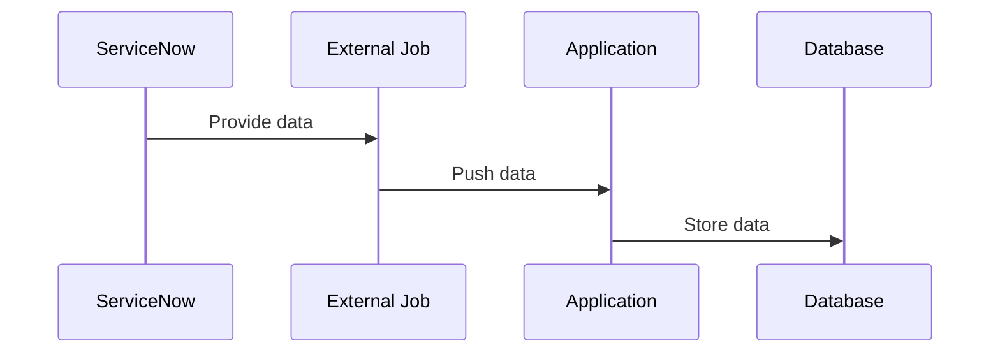
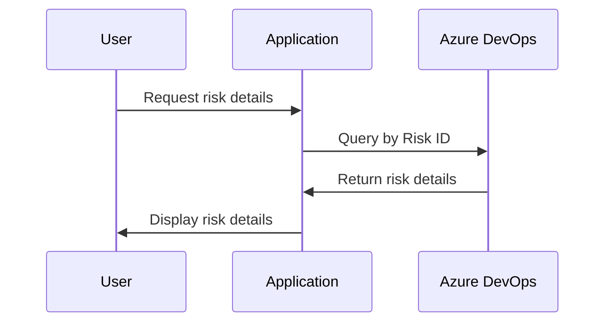
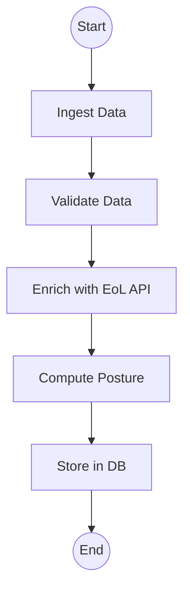
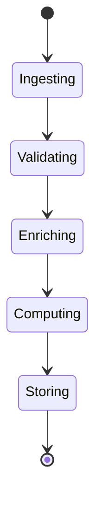

# Sequence Diagrams

## Data Ingest Sequence (Mermaid)

```mermaid
sequenceDiagram
	participant SN as ServiceNow
	participant Job as External Job
	participant App as Application
	participant DB as Database
	SN->>Job: Provide data
	Job->>App: Push data
	App->>DB: Store data
```

## Risk Linkage Sequence (Mermaid)

```mermaid
sequenceDiagram
	participant User as User
	participant App as Application
	participant AzDO as Azure DevOps
	User->>App: Request risk details
	App->>AzDO: Query by Risk ID
	AzDO->>App: Return risk details
	App->>User: Display risk details
```

## Activity Diagram: Data Processing (Mermaid)

```mermaid
graph TD
	Start((Start))
	Ingest[Ingest Data]
	Validate[Validate Data]
	Enrich[Enrich with EoL API]
	Compute[Compute Posture]
	Store[Store in DB]
	End((End))
	Start --> Ingest --> Validate --> Enrich --> Compute --> Store --> End
```

## State Diagram: Application Lifecycle (Mermaid)

```mermaid
stateDiagram-v2
	[*] --> Ingesting
	Ingesting --> Validating
	Validating --> Enriching
	Enriching --> Computing
	Computing --> Storing
	Storing --> [*]
```
