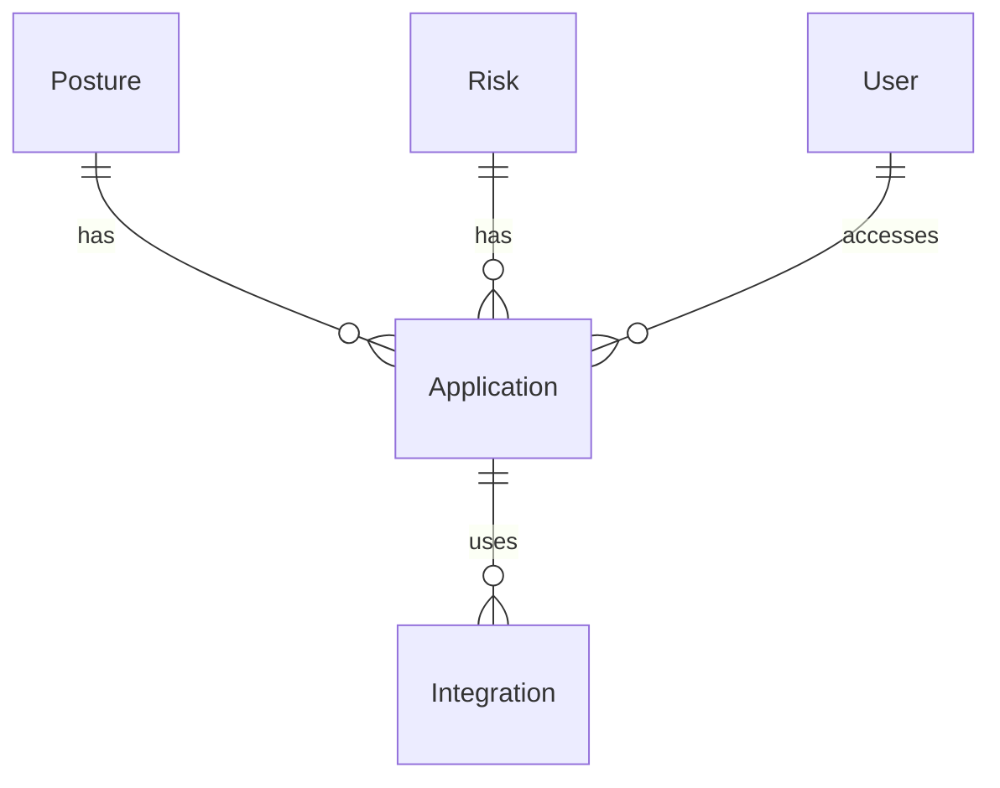

# ERD (Mermaid)

```mermaid
erDiagram
    Posture ||--o{ Application : "has"
    Risk ||--o{ Application : "has"
    User ||--o{ Application : "accesses"
    Application ||--o{ Integration : "uses"
```
